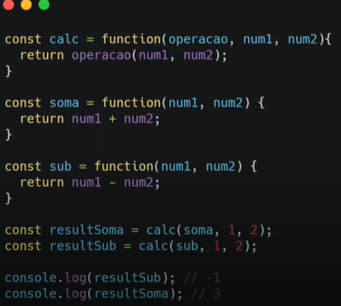
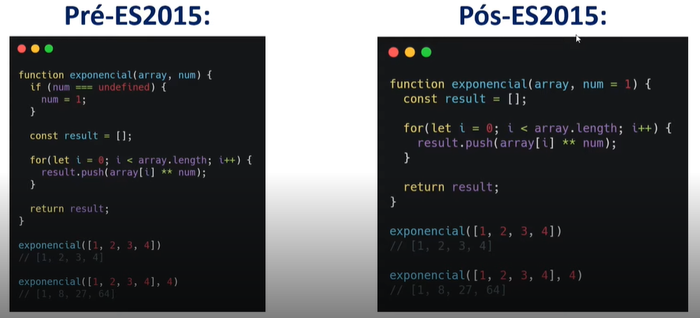
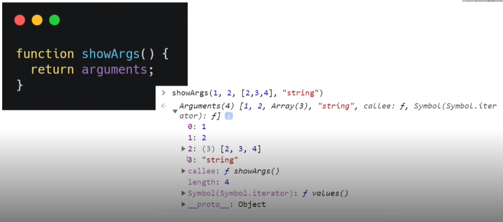
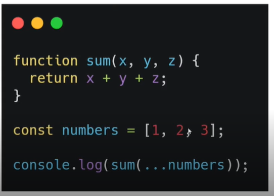
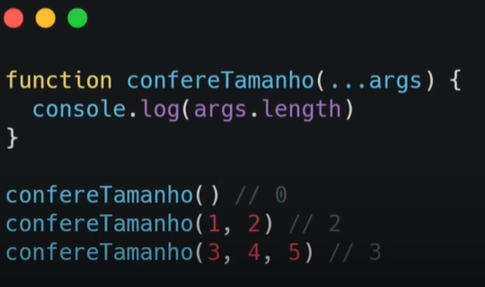

# Dominando funções em JavaScript
## Tipos de função
### Apresentação do curso
### Estrutura e função anônima
Função anônima: representam expressões e não possuem nomes. Uma variável pode armazenar o seu valor de retorno.  

### Função autoinvocável e callbacks
Função autoinvocável: é declarada dentro de um par de parenteses seguido por outro par de parenteses.  

Callback: Uma função passada como argumento para outra.  

## Parâmetros
### Valores padrão e Objeto "arguments"
Valores padrão: definido dentro dos argumentos da função na declaração. No exemplo a seguir, o valor padrão para num, caso ele não seja enviado, será 1:

Objeto "arguments"  

### Arrys e objetos
Spread: Uma forma de lidar separadamente com elementos de um array. A nomenclatura utilizada é ... na frente do nome do array. O que era parte de um array se torna um elemento independente. 

Rest: O contrário do spread. Combina os argumentos de uma função em um array. O que era elemento independente se torna parte de um array. 

Object destruction: Entre chaves {}, podemos filtrar apenas os dados que nos interessam em um objeto.

## Loops
### If/else e switch
### For e While

## This
### O que é this
### Manipulando seu valor

## Arrow functions
### Sintaxe e outras restrições
### Atividade prática