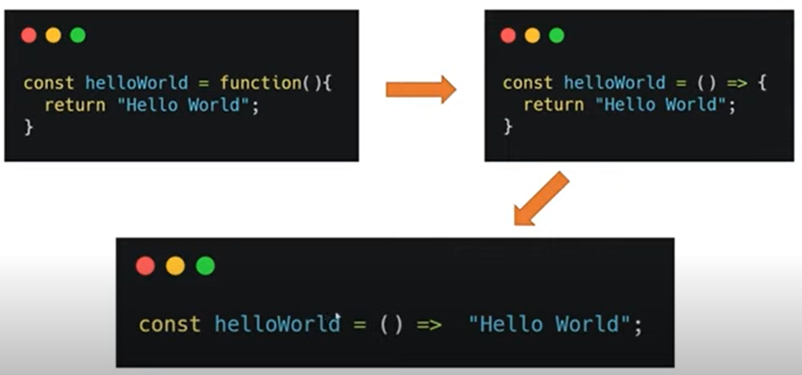

# Dominando funções em JavaScript
## Tipos de função
### Apresentação do curso
### Estrutura e função anônima
Função anônima: representam expressões e não possuem nomes. Uma variável pode armazenar o seu valor de retorno.  

### Função autoinvocável e callbacks
Função autoinvocável: é declarada dentro de um par de parenteses seguido por outro par de parenteses.  

Callback: Uma função passada como argumento para outra.  

## Parâmetros
### Valores padrão e Objeto "arguments"
Valores padrão: definido dentro dos argumentos da função na declaração. No exemplo a seguir, o valor padrão para num, caso ele não seja enviado, será 1:

Objeto "arguments"  

### Arrays e objetos
Spread: Uma forma de lidar separadamente com elementos de um array. A nomenclatura utilizada é ... na frente do nome do array. O que era parte de um array se torna um elemento independente. 

Rest: O contrário do spread. Combina os argumentos de uma função em um array. O que era elemento independente se torna parte de um array. 

Object destruction: Entre chaves {}, podemos filtrar apenas os dados que nos interessam em um objeto.

## Loops
### If/else e switch
### For e While
For...in: Loop entre propriedades enumeráveis de um objeto. 
>function forInExemplo(obj){
>    for(prop in obj){
>        console.log(obj[prop]);
>} 
>}

For..of: Loop entre propriedades iteráveis (arrays, strings).
>function logLetras(palavra){
>    for(letra of palavra){
>        console.log(letra);
>}
>}
>
>const palavra = "abacaxi";
>logLetras(palavra);

>function logNumeros(nums){
>    for(num of nums){
>        console.log(num);
>}
>}
>
>const nums = [30, 50, 67, 76, 36];
>logNumeros(nums);

## This
### O que é this
A palavra reservada this é uma referência de contexto. Seu valor pode alterar de acordo com o lugar no código onde foi chamada.
### Manipulando seu valor
- Método call
- Método apply
- Método bind: clona a estrutura da função onde é chamada e aplica o valor do objeto passado como parâmetro.

## Arrow functions
### Sintaxe e outras restrições

- Caso a função tenha apenas uma linha: pode dispensar as chaves e o return.
- Caso a função tenha apenas um parâmetro: pode dispensar os parênteses.
- Arrow function não faz hoisting.
- Não fazer arrow function sem serem metódos de objetos.
### Atividade prática
